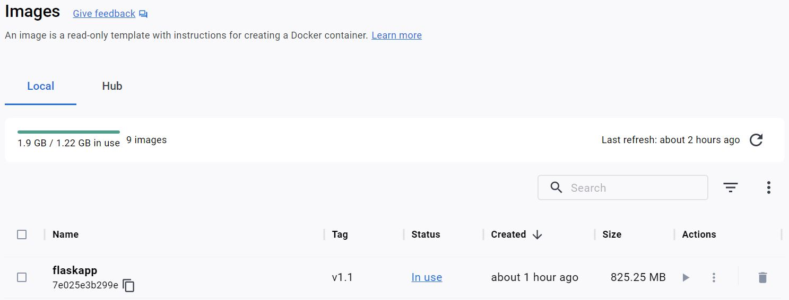
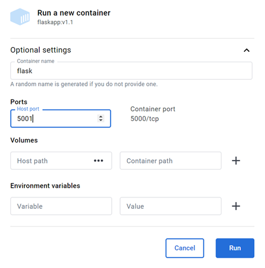
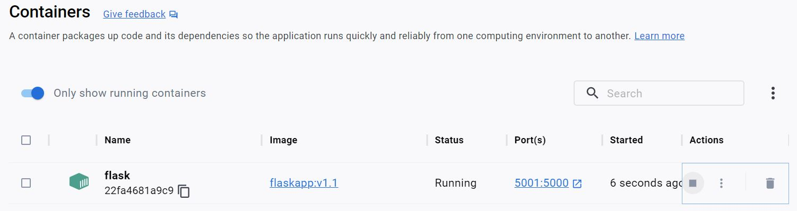
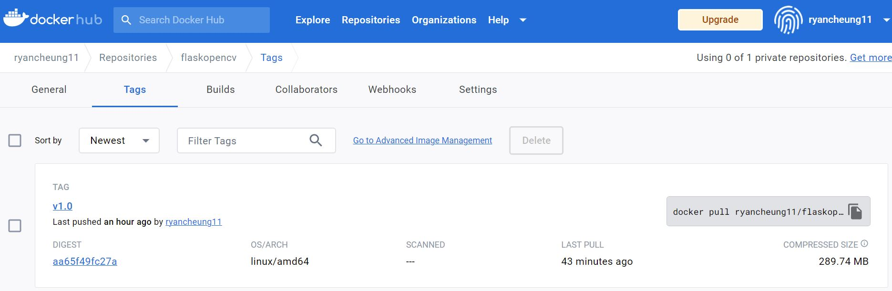

# Pedestrain Distance Calculator in Docker
We used [opendatacam](https://github.com/opendatacam/opendatacam) to detect pedestrains and from the generated JSON file we calculated the distance between people, displayed the edited video in the web browser through flask module then containerizes the whole App.  

### As shown in below screenshot, the distances between people are tagged with numbers.
<!-- [IMAGE] -->

### When the Docker image is built from [Dockerfile](./Dockerfile), the size is shown below
<!-- [IMAGE] -->

### The container is run successfully with container port 5000(tcp) and host post 5001
<!-- [IMAGE] -->

<!-- [IMAGE] -->

### The public accessible image [link](https://hub.docker.com/repository/docker/ryancheung11/flaskopencv)   
Before pushing to the Docker Hub, the orginal size of this image is over 800MB.  
You can see after uploading to Docker Repo, the compressed size is only over 200MB.
<!-- [IMAGE] -->

